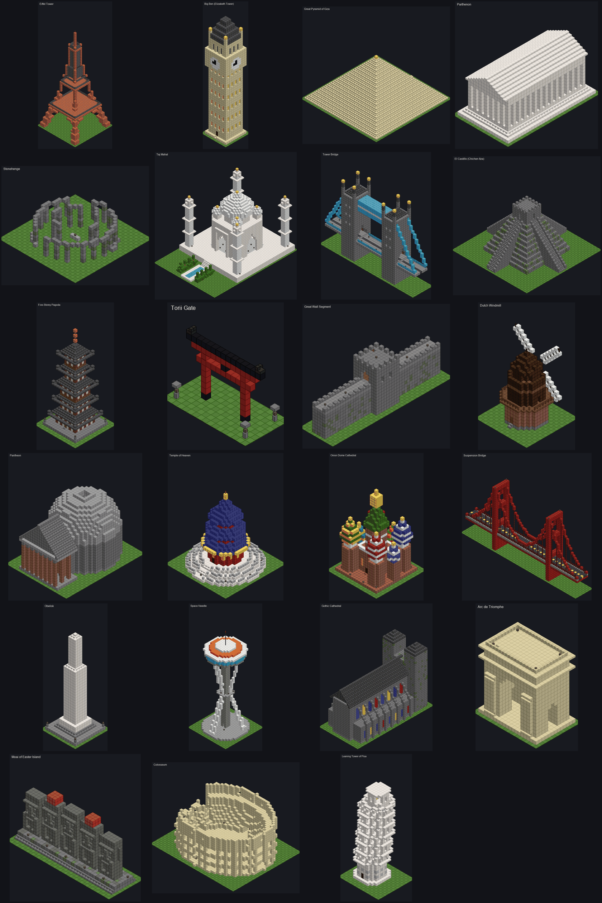
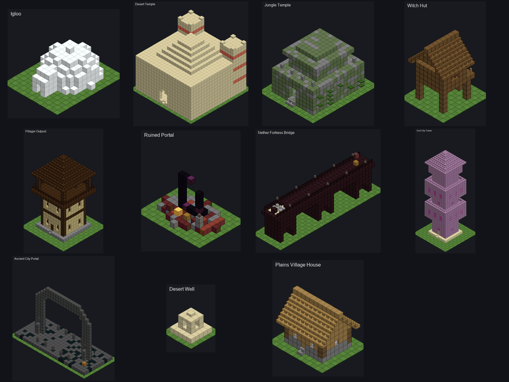
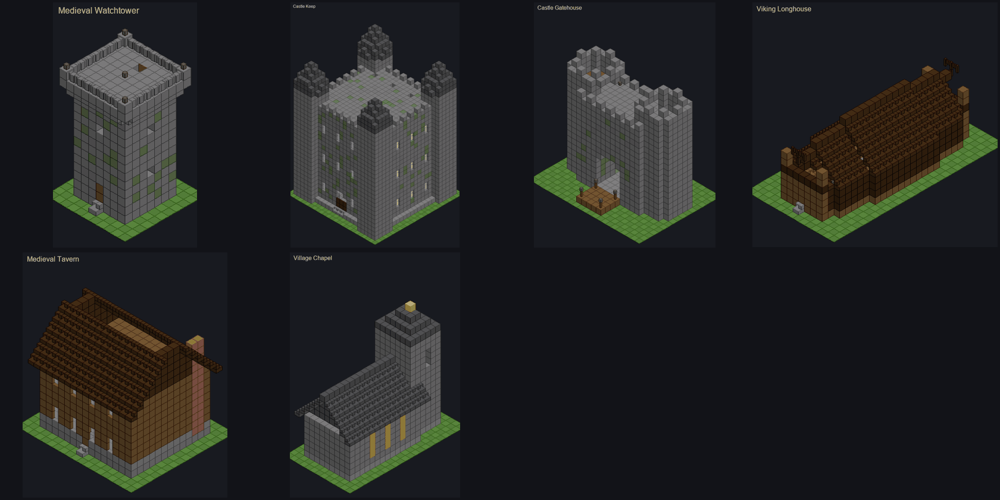
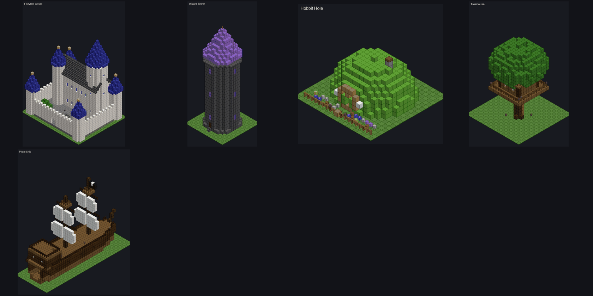
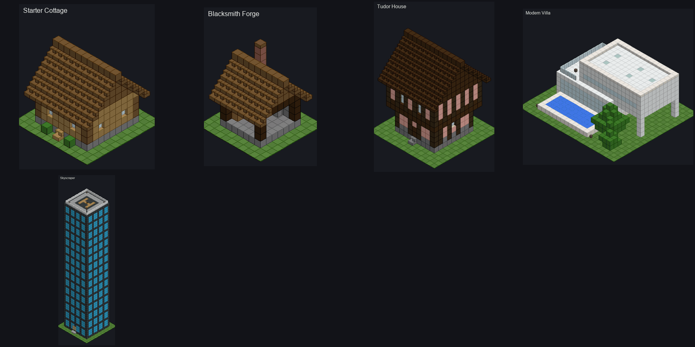
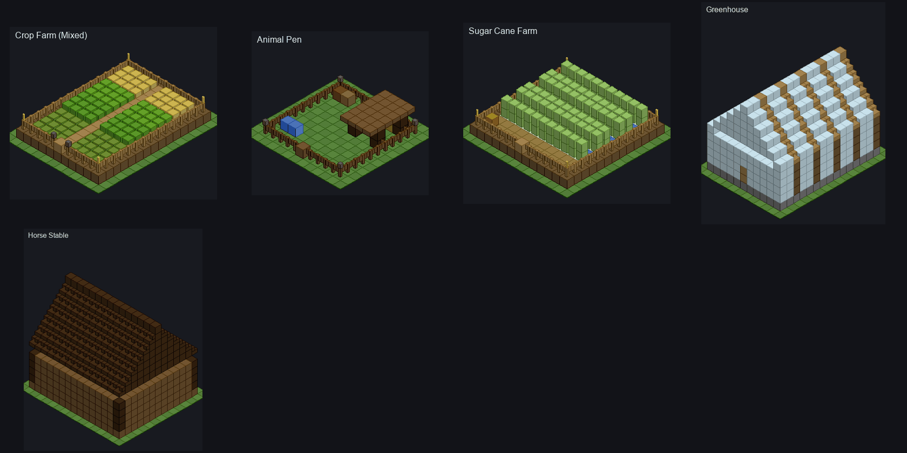
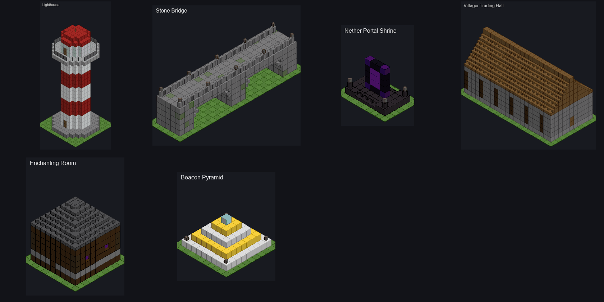
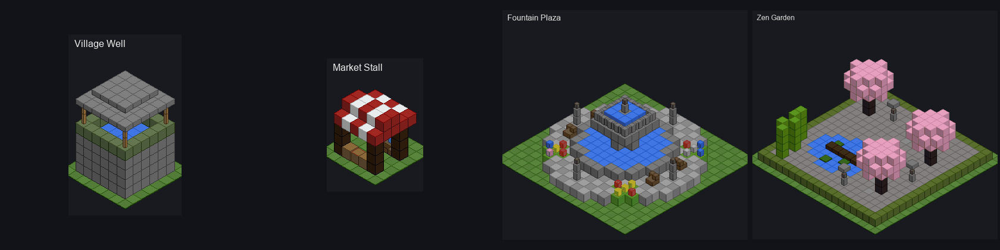

# 🏰 MINECRAFT BUILDER

**Minecraft Auto-Builder & Map Editor** è un'applicazione desktop moderna e performante sviluppata in **Python** e **PyQt6**, progettata per caricare mondi di Minecraft (file Anvil `.mca`), tracciare la posizione in tempo reale del giocatore, visualizzare l'anteprima 2D/3D di strutture (`.nbt`, `.schem`, `.schematic`) e iniettarle direttamente nel mondo con integrazione intelligente al terreno e ai biomi circostanti.

---

## ✨ Funzionalità Principali

- 🗺️ **Visualizzatore Mappa Anvil (.mca)**:
  - **Mappa estesa a tutto il mondo**: tutte le regioni vengono caricate in background (prima quelle vicine alla vista) e si può scorrere liberamente da una regione all'altra; *Tutto il mondo* rimpicciolisce fino a mostrarle tutte (zoom dal 4% al 3200%).
  - **Mappa dettagliata**: ogni pixel ha il colore del blocco in superficie (erba, sabbia, legno, tetti, strade, chiome degli alberi) con ombreggiatura del rilievo e acqua più scura dove è profonda: case, villaggi e costruzioni si riconoscono a colpo d'occhio.
  - **Memoria delle zone già viste**: le regioni disegnate vengono salvate in una cache su disco (`%LOCALAPPDATA%\MinecraftBuilder\map_cache`) insieme all'immagine finale, così riaprendo un mondo già visto la mappa compare in meno di un secondo. Se nel frattempo il gioco (o un'iniezione) ha cambiato una regione, la vecchia immagine compare subito e vengono riletti solo i chunk cambiati.
  - **Mondi estesi**: la prima apertura mostra prima una mappa rapida delle altezze di tutte le regioni richieste, poi i colori; quando la mappa è molto rimpicciolita usa copie ridotte delle regioni, così anche centinaia di regioni restano fluide.
  - **Modalità Live** (pulsante *Live* sopra la mappa): mentre giochi la mappa segue il giocatore (opzione *Segui*), con una freccia nella direzione in cui guarda e la scia del percorso, e ridisegna le zone che il gioco salva. Minecraft scrive su disco posizione e terreno solo quando salva, cioè quando va in pausa o ogni 5 minuti circa: con la mappa su un altro schermo il gioco non va mai in pausa. Per questo, con *Posizione continua* (Windows), mentre stai giocando il programma preme per te F3+C ogni 2 secondi e legge le coordinate, poi rimette negli appunti quello che c'era; i tasti partono solo con Minecraft in primo piano e nessuna chat, cartello, libro o inventario aperti. Nella chat del gioco compare il messaggio di F3+C. Il terreno nuovo compare invece ai salvataggi del gioco.
  - **Strutture sulla mappa**: le strutture iniettate con il programma vengono registrate in `minecraft_builder.json` e disegnate con riquadro e nome, colorate per categoria (da lontano restano visibili come punti); villaggi, templi, portali e altre strutture generate dal gioco sono riquadrate in azzurro. Passando il mouse si vedono nome, coordinate e dimensioni; il menu *Vai a una struttura...* centra la mappa su ognuna.
  - Zoom incentrato sul cursore (rotellina o +/-), pan con trascinamento o frecce/WASD, griglia dei chunk e scala in blocchi.
  - HUD con coordinate globali, regione, chunk, altezza Y e strutture sotto il cursore.
- 📂 **Apertura automatica del mondo**:
  - Basta indicare un qualsiasi percorso legato al mondo: la cartella del mondo, una sua sottocartella (`region`, `DIM-1`, `playerdata`...), `level.dat`, un file `.mca`, la cartella `saves` o `.minecraft`. L'app ricava da sola cartella dei salvataggi, mondo e dimensione.
  - Il percorso si può scegliere con *Sfoglia...*, incollare nel campo (Invio) o trascinare sulla finestra; da riga di comando: `py -3 main.py "percorso"`.
  - Selettore Overworld / Nether / End, elenco dei soli mondi validi (dal più recente) e ripresa automatica dell'ultimo mondo aperto.
- 🗂️ **Libreria per categorie**: Case, Castelli e fortezze, Torri, Ponti, Monumenti, Templi e luoghi sacri, Fattorie e animali, Farm automatiche, Hub e magazzini, Piazze e decorazioni, Utilità e magia, Navi, Rovine e portali, Fantascienza e Ritagli, con ricerca per nome/descrizione.
- 🌉 **Ponti su misura** (scheda *Ponti*): quattro stili (pietra ad archi, legno, mattoni del Nether, sospeso) di qualsiasi lunghezza.
  - *Disegna ponte tra due sponde*: due clic sulla mappa. Il ponte è dritto e parte dal primo clic (l'anteprima mostra l'ingombro mentre muovi il mouse); il profilo del terreno viene letto blocco per blocco e lunghezza, altezza, piloni e rampe vengono calcolati da soli.
  - Le estremità arrivano sempre a terra: se le sponde sono ad altezze diverse il ponte scende con una rampa di scale fino alla sponda più bassa, senza capi sospesi nel vuoto.
  - **Integra con l'ambiente** (opzione): l'impalcato sale dolcemente da una sponda all'altra (un blocco ogni due), resta abbastanza alto sull'acqua da far passare le barche sotto gli archi, scavalca le colline invece di scavarle e usa i materiali del posto (arenaria nel deserto, arenaria rossa nelle badlands, mattoni di fango nelle paludi, pietra muschiosa nella giungla, il legno degli alberi vicini).
  - I piloni scendono fino al fondo del fiume; sulla terraferma il ponte diventa un terrapieno pieno fino al terreno, mentre sotto gli archi resta lo spazio vuoto.
  - Se il nuovo ponte parte vicino alla fine di un ponte esistente (in coda o costruito in precedenza, memorizzato nel mondo) lo prosegue senza interruzioni, nello stesso stile e alla stessa altezza dell'estremità.
  - Il ponte sospeso resta piano e alto sull'acqua: alle due estremita' una rampa con mezzi blocchi scende fino alla sponda.
  - I ponti della libreria si possono allungare o accorciare mantenendo lo stile.
- 🏰 **Mura difensive** (scheda *Mura*): cinque stili (pietra medievale, arenaria del deserto, ardesia nordica, pietra nera, palizzata di legno), altezza regolabile.
  - *Suggerisci il perimetro*: le mura vengono proposte intorno alle costruzioni vicine al giocatore (e alle strutture piazzate col programma), con un margine di 10 blocchi.
  - *Disegna il perimetro*: clic sui vertici sulla mappa (linee allineate a 0/45/90 gradi, Shift per linee libere), clic sul primo punto o Invio per chiudere, doppio clic per un tratto aperto, Backspace per togliere l'ultimo punto.
  - Il camminamento segue il terreno salendo o scendendo al massimo di un blocco alla volta (con scale), merli all'esterno, parapetto e lanterne all'interno, torri agli angoli e a intervalli regolari con porta verso l'interno e scala a pioli fino al tetto.
  - Porte: la posizione viene consigliata dove passa una strada o dove il terreno è libero, piano e asciutto (senza demolire costruzioni); se ne possono aggiungere altre con un clic. Tipi: arco aperto, portone con cancelli, **ponte levatoio**. Sulle mura oblique il tratto intorno alla porta viene raddrizzato, così il corpo di guardia si unisce alle mura senza sporgere.
  - **Portone a saracinesca**: un grande ingresso largo 5 blocchi con cornice scolpita, chiave di volta, caditoie, stendardi e due torrette merlate. Quando si chiude, 5 pistoni appiccicosi nascosti nel soffitto abbassano la grata di sbarre di ferro e 5 pistoni sotto la strada alzano una fila di blocchi: l'apertura si chiude tutta. I fili di redstone corrono dentro le torri e sotto la strada e non si vedono.
  - **Due leve per ogni porta** (portone e ponte levatoio): una sul muro interno del corpo di guardia, accanto al passaggio, e una nascosta fuori in un cespuglio accanto alla strada d'arrivo. Funzionano come i due interruttori della luce delle scale: ogni scatto di una delle due apre o chiude la porta, quindi si apre da fuori, si entra e si richiude da dentro. La logica è un OR esclusivo fatto con due comparatori in sottrazione, verificato con un simulatore di redstone nei test. Nel ponte levatoio le leve tengono il ponte alzato, i sensori lo alzano da soli quando qualcuno si avvicina.
  - Ponte levatoio automatico: davanti alla porta c'è un fossato. Due sensori sculk nascosti sotto le strade, fuori dalla portata d'ascolto dei pistoni (così non si riattivano da soli), sentono chi si avvicina e 6 pistoni appiccicosi fanno emergere il ponte dall'acqua; un ramo ritardato con ripetitori lo tiene su durante il tempo di ricarica dei sensori e per circa due secondi dopo l'ultimo movimento, il tempo di attraversare. Il circuito è verificato da un simulatore di redstone nei test.
  - Luci automatiche: nel passaggio le lampade si accendono al movimento (sensori sculk) e sulle torri, sulla porta e lungo le mura si accendono da sole di notte (rilevatori di luce diurna invertiti).
  - **Allineamento mentre disegni**: avvicinandoti al primo punto la mappa dice se la chiusura è allineata (verde) o no (arancione) e mostra l'angolo che la allineerebbe; il tasto **C** chiude il perimetro aggiungendo quell'angolo.
- 🛣️ **Strade** (scheda *Strade*): cinque stili (sentiero, ciottoli, lastricata, deserto, ardesia), larghezza da 1 a 9, lampioni a intervallo regolabile e cordoli.
  - Si disegnano come le mura: clic sui punti (0/45/90 gradi, Shift per linee libere), Invio o doppio clic per finire.
  - **Aggancio alle strade esistenti**: vicino a una strada già costruita col programma il punto si aggancia da solo (cerchio azzurro); le estremità entro 8 blocchi da una strada, anche un sentiero o una strada lastricata già presente nel mondo, vengono collegate a quella.
  - Il fondo segue il terreno salendo o scendendo al massimo di un blocco alla volta (con un mezzo blocco su ogni gradino): riempie gli avvallamenti, taglia le piccole gobbe e toglie gli alberi d'intralcio. Sull'acqua diventa una passerella di legno su pali.
- ✏️ **Modifica e demolizione di mura e strade già costruite**:
  - Le mura e le strade costruite col programma vengono ricordate nel mondo e disegnate sulla mappa (mura a tratto e punto, strade in marrone), con l'elenco nelle schede *Mura* e *Strade*.
  - **Modifica**: il perimetro o il tracciato tornano sulla mappa con i punti azzurri: trascinali, doppio clic su un tratto aggiunge un punto, clic destro su un punto lo toglie. Lo stesso vale per un perimetro appena disegnato e non ancora costruito (*Modifica il perimetro*).
  - In coda vanno la demolizione della versione vecchia e la costruzione della nuova, ripianificata sul terreno originale.
  - **Demolisci**: toglie l'opera e rimette il terreno esattamente com'era, perché al momento della costruzione vengono memorizzati i blocchi originali di ogni colonna toccata.
  - Anche modifiche e demolizioni si possono annullare con *Annulla ultima iniezione*.
- 🏘️ **Generatore di villaggi** (scheda *Villaggio*): pianura, borgo medievale o nordico, in tre dimensioni. Crea piazza, strade a croce che seguono il terreno, edifici con la porta rivolta verso la strada, fattorie, sentieri e lampioni, evitando acqua, pendii e zone non generate.
- ✂️ **Ritagli** (scheda *Ritagli*): trascina un rettangolo sulla mappa per salvare una zona di un mondo come struttura, **senza limiti di dimensione** (il ritaglio gira in background con l'avanzamento nel log: un'area di 400×400 con il terreno, 3 milioni di blocchi, si estrae in circa 10 secondi). In modalità *Solo costruzioni* terreno, piante e alberi naturali non vengono copiati e viene memorizzata la quota d'appoggio, così incollandola su un'altra mappa si adatta al nuovo terreno (cantine comprese); in modalità *Tutto* viene copiato anche il terreno. Vengono copiati anche il contenuto di casse e barili, i testi dei cartelli, gli stendardi e le entità (cornici, armor stand, animali). Neve compatta, terracotta e ghiaccio sono anche il terreno di alcuni biomi e di solito restano fuori: un'opzione del ritaglio li tiene quando la costruzione e' fatta di questi blocchi (igloo, case di terracotta).
  - **Dettagli completi anche nelle strutture grandi**: un blocco "naturale" viene tenuto quando fa parte della costruzione: terra, erba, fiori e colture appoggiati sopra la costruzione (giardini pensili, fioriere, campi su terra arata, sabbia sui tetti), soffitti di pietra, ghiaccio o glowstone sopra le stanze, rampicanti, licheni e cacao attaccati ai muri, canne da zucchero e bambù delle farm accanto a osservatori e pistoni. Glowstone, netherrack e gli altri blocchi del Nether e dell'End nell'Overworld sono sempre considerati costruiti (lampade, camini). Corretti anche barbabietole, gambi di zucca e melone e blocchi di corallo morto, che prima venivano scartati.
  - **Terreno racchiuso dalla costruzione** (opzione, attiva di base): il prato di un cortile, il campo di uno stadio, l'aiuola di un giardino chiuso da mura o recinti vengono copiati con la costruzione (lo strato in superficie, con fiori e alberi); le aperture strette come porte e cancelli non contano come uscite. Il ritaglio dello stadio di Oshode City ora ha il campo da calcio, prima mancante; quello della RedstoneSmartHouse il giardino e non piu' i blocchi di arenaria del deserto.
- 📍 **Rilevamento e Tracciamento Giocatore**:
  - Localizzazione automatica delle ultime coordinate del giocatore dai file di salvataggio (`level.dat`, `playerdata`, `players`).
  - Animazione radar circolare pulsante sul marker del giocatore.
  - Pulsante per centrare istantaneamente la visuale sulla regione del personaggio.
- 🏗️ **Gestione e Posizionamento Strutture**:
  - Libreria integrata di 103 modelli vanilla giocabili (monumenti famosi, classici di Minecraft, castelli, case, fattorie) più le strutture da mod originali (*Ice and Fire*, *Better Strongholds*, *Create Astral*).
  - Browser per cercare e scaricare schemi online.
  - Anteprima grafica top-down 2D dei blocchi reali con trasparenza per allineamento preciso.
  - Rotazione a 90° oraria (`R`) e drag-and-drop con click-to-place: un clic posiziona la struttura, trascinando fuori dalla struttura si sposta la mappa, trascinando la struttura la si sposta.
  - Sistema di code a posizionamenti multipli (Staging) per iniettare più strutture contemporaneamente.
  - **Strutture in coda modificabili sulla mappa**: un clic su una struttura in coda la seleziona (anche nell'elenco della coda); trascinandola si sposta e la sua altezza si riadatta al terreno, `R` la ruota sul posto, `Canc` la toglie, `Ctrl+D` ne mette in coda un'altra uguale accanto, `Esc` deseleziona; le stesse azioni sono nel menu del tasto destro. Maiusc+clic posiziona una nuova struttura anche sopra una gia' in coda. Mura, strade e ponti si cambiano con *Modifica* nelle loro schede.
- 🌱 **Integrazione Intelligente col Terreno**:
  - **Adattamento Altezza**: Calcolo automatico della quota media dell'ingombro della struttura.
  - **Fondamenta Naturali**: Rilevamento del terreno reale sotto la struttura (erba/terra, sabbia/arenaria, neve, roccia) e riempimento dei vuoti sottostanti. Archi e ponti mantengono lo spazio vuoto sotto le campate.
  - **Scavo Terreno**: Rimozione automatica di ostacoli (terra, pietra, alberi) per i volumi interni d'aria.
  - **Paesaggio naturale** (*Terreno intorno*, predefinito): se la struttura sta piu' in alto del terreno sale una collina dal bordo irregolare con i materiali del bioma letto dal mondo (erba, sabbia, neve, podzol, sabbia rossa, roccia dove e' ripido), con erba, fiori del bioma, massi e alberelli; dalle porte scende una **scalinata a tema** nel materiale della struttura (o del bioma), che segue il pendio con lanterne lungo il percorso. Su un pendio il terreno davanti alla struttura viene terrazzato. Sull'acqua nasce un'**isola**: cuore erboso, spiaggia di sabbia asciutta, fondale che scende dolcemente con alghe, canne da zucchero sulla riva e palme nei biomi caldi.
  - **Barche e strutture sottomarine** (*Sull'acqua: Galleggia*): niente isola; la struttura sta immersa di quanti blocchi scegli (*Immersione*) e l'acqua rimasta dentro lo scafo sotto il pelo dell'acqua viene tolta. La scelta e l'immersione vengono ricordate per ogni struttura; navi e barche (categoria *Navi* o nomi come nave, barca, galeone, sottomarino) galleggiano gia' di base.
  - **Strutture a cavallo delle regioni**: i blocchi oltre il bordo del file `.mca` vengono scritti nelle regioni vicine.
  - **Rotazione completa**: oltre a `facing`/`axis` ruotano anche recinti, vetri, muretti, cartelli, stendardi e binari.
  - **Consiglio Posizione Ottimale**: Scanner euristico per individuare la zona più pianeggiante nelle vicinanze.
- 🏭 **Hub sotterraneo e farm automatiche** (categorie *Hub e magazzini* e *Farm automatiche*):
  - **Hub sotterraneo esagonale** (22 blocchi sotto terra): cupola gotica a costoloni, stazioni di incanti, alchimia, officina e fonderia, ascensore a bolle con scala a chiocciola fino a un chiosco in superficie, porte di servizio per agganciare altri moduli.
  - **Magazzino automatico** dell'hub: smistatore a 9 oggetti, a prova di trabocco. I filtri sono già riempiti e i barili hanno già il nome.
  - **Iron farm 1.21** in una fonderia di mattoni: 3 villager e 1 zombie già inclusi, piattaforma d'acqua e lama di lava, feritoia che si chiude di notte (così i villager dormono) e leva per spegnere la farm.
  - Circuiti verificati con un simulatore di redstone analogico; scheda tecnica, distinta materiali e checklist di prova in gioco in [docs/HUB_E_IRON_FARM.md](docs/HUB_E_IRON_FARM.md).
- 🧬 **Entità e contenuti**: i modelli possono contenere mob (scritti nella cartella `entities/` del mondo, persistenti, con un UUID nuovo) e oggetti nei contenitori, anche rinominati (formato adattato alla versione del mondo). Le strutture interrate dichiarano quanti strati stanno sotto il terreno e l'app propone la quota giusta.
- ↩️ **Annulla ultima iniezione**: rimette le regioni come prima dell'ultima iniezione usando i backup automatici; la cronologia (ultime 20 iniezioni) è salvata nel mondo, quindi funziona anche dopo aver riavviato il programma e si può ripetere per annullare anche le precedenti. Toglie dalla mappa anche le strutture e i ponti di quell'iniezione.
- ⚡ **Architettura Asincrona & Sicurezza**:
  - Iniezione blocchi gestita in un thread dedicato in background (`QThread`) senza bloccare l'interfaccia utente.
  - Modifica per sezioni (ogni sezione 16×16×16 viene decodificata e ricodificata una sola volta): migliaia di volte più veloce dell'approccio blocco per blocco.
  - **Ritagli enormi**:
    - Le strutture con più di un milione di blocchi restano compatte in memoria (pochi byte per blocco invece di un oggetto per blocco).
    - Si caricano e si salvano a flusso, senza mai tenere il file intero decompresso, e la rotazione è istantanea.
    - Nel test sul ritaglio di New York (27 milioni di blocchi) il picco di memoria in lettura scende da 2 GB a circa 530 MB; il guadagno vale per i ritagli salvati dall'app da ora in poi.
  - **Iniezione grande in parallelo**: i blocchi vengono divisi per chunk e i chunk elaborati da più processi in parallelo. Ogni chunk viene compresso appena finito, quindi il salvataggio finale è immediato. Nel test sul mondo di prova i 27 milioni di blocchi di New York si iniettano in circa 20 secondi; backup e *Annulla ultima iniezione* funzionano come sempre.
  - Selezionando un ritaglio molto grande, caricamento e anteprima avvengono in background; l'anteprima resta in cache su disco e ruotarla non richiede ricalcoli.
  - Regioni caricate in modo lazy: la mappa legge solo le heightmap e il salvataggio riscrive solo i chunk modificati, copiando gli altri byte per byte.
  - Scrittura atomica e backup automatico di ogni file `.mca` modificato.
  - I blocchi che hanno bisogno di un'entità (rilevatori di luce, sensori sculk, casse, letti, cartelli...) ricevono un'entità vuota, così funzionano subito; i collegamenti della polvere di redstone vengono calcolati come fa il gioco.
  - La mappa dettagliata viene disegnata in parallelo su più processi leggendo dei chunk solo palette, heightmap e strutture (il resto viene saltato): la prima volta 30 regioni grandi richiedono circa 7 secondi (prima 25), riaperte dalla cache mezzo secondo.
  - Luce e heightmap dei chunk modificati invalidate: Minecraft le ricalcola al caricamento.
  - I chunk non generati vengono saltati (mai creati vuoti) e i blocchi di mod vengono saltati nei mondi vanilla.
  - Compatibile con i mondi dalla 1.18 a Minecraft 26.x: legge e scrive sia il formato classico dei blocchi (`{Name, Properties}`) sia quello nuovo (stringhe e `{id, properties}`), e aggiorna i nomi dei blocchi rinominati (es. `chain` → `iron_chain`, `grass` → `short_grass`) in base alla versione del mondo.
  - Le fondamenta riempiono solo vuoti piccoli (fino a 10 blocchi) e mai sotto strutture appoggiate sull'acqua: le costruzioni sospese restano sospese; i piloni dei ponti scendono fino al fondo.
  - Rilevamento dello stato di blocco del mondo (`session.lock`) per prevenire corruzioni di dati.
  - Elevazione a Amministratore (UAC) solo su richiesta con `py -3 main.py --admin`.
  - Console di log high-tech con colorazione sintattica HTML delle operazioni.

---

## 🚀 Requisiti e Installazione

### Prerequisiti
- **Python 3.10+**
- **Git**

### Installazione

1. Clona il repository:
   ```bash
   git clone https://github.com/mescalistan/MINECRAFT-BUILDER.git
   cd MINECRAFT-BUILDER
   ```

2. Installa le dipendenze:
   ```bash
   pip install -r requirements.txt
   ```

3. Avvia l'applicazione:
   - **Windows**: doppio clic su `avvia.bat` (installa le dipendenze al primo avvio), oppure
     ```bash
     py -3 main.py
     ```
   - **Altri sistemi**:
     ```bash
     python3 main.py
     ```

   > Se compare `No module named 'PyQt6'`, il comando `python` sta aprendo un interprete diverso da quello in cui `pip` ha installato le dipendenze (ad esempio un Python di MSYS2 nel PATH). Usa `avvia.bat` o `py -3 main.py`.

---

## 📦 Struttura del Progetto

```
.
├── main.py                 # Finestra principale, controller GUI, worker thread asincrono
├── map_viewer.py           # Canvas interattivo della mappa multi-regione, overlay strutture e HUD
├── map_tiles.py            # Tessere della mappa (colori dei blocchi, strutture del gioco) e cache su disco
├── landscape.py            # Terreno intorno alle strutture incollate: colline, scalinate, isole, barche
├── game_link.py            # Modalità Live: finestra di Minecraft in primo piano e F3+C automatico (Windows)
├── mca_codec.py            # Parser e scrittore Anvil (.mca) lazy, ChunkEditor per sezioni, heightmap
├── world_editor.py         # Accesso al mondo in coordinate globali (multi-regione), iniezione, sentieri
├── world_locator.py        # Riconosce mondo/saves/dimensione da qualsiasi percorso
├── catalog.py              # Catalogo delle strutture con categorie in italiano
├── structure_generators.py # Ponti parametrici, ponte tra due sponde con profilo del terreno e materiali del posto
├── walls.py                # Mura, torri, porte, ponte levatoio a pistoni con sensori sculk, luci automatiche
├── roads.py                # Strade che seguono il terreno, passerelle sull'acqua, aggancio alle strade esistenti
├── village_generator.py    # Generatore di villaggi
├── world_extractor.py      # Ritaglio di zone di mondo come strutture
├── nbt_codec.py            # Codec puro Python per la lettura/scrittura di file NBT
├── structure_manager.py    # Caricatore di strutture (.nbt/.schem) e trasformazioni 3D
├── scraper.py              # Catalogo schemi online e downloader
├── templates/              # Cartella schemi e strutture preinstallate
├── tools/
│   ├── template_builder.py # Mini-DSL per creare strutture .nbt (stanze, cupole, archi, tetti...)
│   ├── templates/          # Definizioni dei template, un modulo per categoria
│   ├── build_templates.py  # Genera i template vanilla 1.21 e templates/catalog.json
│   ├── validate_templates.py # Validatore di giocabilita' dei template
│   ├── render_templates.py # Render isometrici e gallerie in docs/
│   └── blockinfo.py        # Conoscenza dei blocchi vanilla (nomi, proprieta', luce, colori)
├── docs/                   # Gallerie e render dei template
├── tests/                  # Test automatici su mondi sintetici: python -m unittest discover -s tests
└── requirements.txt        # Dipendenze Python
```

### 🧱 Libreria di template vanilla (103 modelli)

Tutti generati da codice con `python tools/build_templates.py` (solo blocchi vanilla, DataVersion 3955 / MC 1.21.1), validati automaticamente per la giocabilità e testati con iniezione in un mondo. Il livello y=0 di ogni modello è il primo strato sopra il terreno.


#### 🌍 Monumenti famosi (23)



| Modello | File | Dimensioni (X×Y×Z) | Descrizione |
|---|---|---|---|
| Arc de Triomphe | `arc_de_triomphe.nbt` | 17×19×11 | Arco di Trionfo di Parigi con fornice principale, archi laterali, rilievi e terrazza panoramica. |
| Big Ben (Elizabeth Tower) | `big_ben.nbt` | 11×52×11 | Torre dell'orologio di Londra con quadranti, cella campanaria, guglia e scala interna. |
| Colosseum | `colosseum.nbt` | 41×17×33 | Colosseo di Roma: anello ellittico a quattro ordini di arcate, gradinate, arena e un lato in rovina. |
| Dutch Windmill | `dutch_windmill.nbt` | 17×26×17 | Mulino a vento olandese di Kinderdijk: base ottagonale in mattoni, ballatoio, cappello e pale in tela. |
| Eiffel Tower | `eiffel_tower.nbt` | 25×60×25 | Torre Eiffel in scala: quattro gambe ad arco, due piattaforme panoramiche e scala a pioli centrale. |
| El Castillo (Chichen Itza) | `el_castillo.nbt` | 45×25×45 | Piramide maya di Kukulkan: nove terrazze, scalinate sui quattro lati e tempio sulla cima. |
| Five-Storey Pagoda | `five_storey_pagoda.nbt` | 17×38×17 | Pagoda giapponese a cinque piani con gronde ricurve, pilastro centrale e guglia sorin. |
| Gothic Cathedral | `gothic_cathedral.nbt` | 23×42×47 | Cattedrale gotica ispirata a Notre-Dame: navata alta, archi rampanti, rosone, vetrate colorate e due torri. |
| Great Pyramid of Giza | `great_pyramid.nbt` | 39×21×39 | Grande Piramide con facce lisce, corridoio d'ingresso illuminato e camera del re con il tesoro. |
| Great Wall Segment | `great_wall.nbt` | 11×17×45 | Tratto della Grande Muraglia cinese con camminamento merlato e torre di guardia abitabile. |
| Leaning Tower of Pisa | `leaning_tower_pisa.nbt` | 15×40×15 | Torre di Pisa pendente in marmo con logge a colonne, cella campanaria e scala interna. |
| Moai of Easter Island | `moai_heads.nbt` | 19×13×8 | Tre statue Moai dell'Isola di Pasqua su un ahu di pietra, una con il pukao rosso. |
| Obelisk | `obelisk.nbt` | 13×38×13 | Obelisco in marmo bianco in stile Washington Monument, su piazza a gradini con lanterne. |
| Onion Dome Cathedral | `onion_dome_cathedral.nbt` | 21×34×21 | Cattedrale a cupole a cipolla ispirata a San Basilio: torre centrale a tenda e cappelle con cupole colorate a strisce. |
| Pantheon | `pantheon.nbt` | 25×24×33 | Pantheon di Roma: rotonda con cupola e oculo, pavimento a scacchi e pronao a colonne con frontone. |
| Parthenon | `parthenon.nbt` | 19×18×33 | Partenone di Atene: stilobate a gradini, peristilio di colonne doriche, frontoni e cella con statua. |
| Space Needle | `space_needle.nbt` | 23×56×23 | Torre panoramica ispirata allo Space Needle di Seattle: gambe a clessidra, disco ristorante vetrato e guglia. |
| Stonehenge | `stonehenge.nbt` | 27×8×27 | Cerchio megalitico di Stonehenge con architravi, triliti interni, pietre cadute e altare. |
| Suspension Bridge | `suspension_bridge.nbt` | 71×36×9 | Ponte sospeso rosso ispirato al Golden Gate: due torri con traversi, cavi parabolici, tiranti e carreggiata. |
| Taj Mahal | `taj_mahal.nbt` | 41×36×57 | Taj Mahal in marmo bianco: piattaforma, iwan ad arco, cupola a cipolla, quattro minareti e vasca riflettente. |
| Temple of Heaven | `temple_of_heaven.nbt` | 25×28×25 | Tempio del Cielo di Pechino: tre terrazze di marmo con balaustre, sala rotonda rossa e tre tetti blu con pinnacolo d'oro. |
| Torii Gate | `torii_gate.nbt` | 15×11×7 | Portale torii rosso in stile Itsukushima con architrave nera ricurva e lanterne di pietra. |
| Tower Bridge | `tower_bridge.nbt` | 49×36×9 | Tower Bridge di Londra: due torri gotiche, passerelle alte vetrate, catene blu e carreggiata. |

#### ⛏️ Classici di Minecraft (11)



| Modello | File | Dimensioni (X×Y×Z) | Descrizione |
|---|---|---|---|
| Ancient City Portal | `ancient_city_portal.nbt` | 27×19×11 | Il grande portale della citta' antica in ardesia rinforzata, con sculk, lanterne dell'anima e casse. |
| Desert Temple | `desert_temple.nbt` | 21×16×21 | Tempio del deserto con torri decorate in terracotta, sala centrale a mosaico e quattro casse del tesoro. |
| Desert Well | `desert_well.nbt` | 5×5×5 | Il classico pozzo del deserto in arenaria con acqua al centro e tettoia su quattro pilastri. |
| End City Tower | `end_city_tower.nbt` | 15×38×15 | Torre della citta' dell'End in purpur, con stanze sporgenti, verghe dell'End e vetrate magenta. |
| Igloo | `igloo.nbt` | 11×6×14 | Igloo di neve con tunnel d'ingresso, letto, fornace, banco da lavoro e tappeti. |
| Jungle Temple | `jungle_temple.nbt` | 14×12×17 | Tempio della giungla in pietrisco muschioso su due livelli, con viticci, scalinata e cassa. |
| Nether Fortress Bridge | `nether_fortress_bridge.nbt` | 7×11×31 | Ponte della fortezza del Nether in mattoni infernali con archi, ringhiere e giardino di verruche. |
| Pillager Outpost | `pillager_outpost.nbt` | 15×24×15 | Avamposto dei predoni in quercia scura e betulla, con piani collegati da scale e terrazza di vedetta. |
| Plains Village House | `plains_village_house.nbt` | 11×10×9 | Casa del villaggio delle pianure: fondamenta in pietrisco, travi di quercia, fioriere e arredamento. |
| Ruined Portal | `ruined_portal.nbt` | 13×10×9 | Portale in rovina con cornice di ossidiana spezzata, netherrack, magma, oro e cassa del bottino. |
| Witch Hut | `witch_hut.nbt` | 9×14×10 | Capanna della strega su palafitte in abete con calderone, vaso con fungo e scala d'accesso. |

#### 🏰 Medievale (6)



| Modello | File | Dimensioni (X×Y×Z) | Descrizione |
|---|---|---|---|
| Castle Gatehouse | `castle_gatehouse.nbt` | 21×22×15 | Corpo di guardia con saracinesca, due torri cilindriche, ponte levatoio e camminamento merlato. |
| Castle Keep | `castle_keep.nbt` | 23×33×23 | Mastio normanno a quattro piani con torrette angolari, sala del trono, camere, armeria e camminamento. |
| Medieval Tavern | `medieval_tavern.nbt` | 17×15×15 | Taverna su due piani: bancone, botti, tavoli, focolare con camino e stanze per gli ospiti al piano di sopra. |
| Medieval Watchtower | `watchtower.nbt` | 9×16×9 | Torre di guardia 7x7 alta 16 blocchi con scala a pioli, piano intermedio e merli. |
| Viking Longhouse | `viking_longhouse.nbt` | 13×12×27 | Casa lunga vichinga a forma di scafo con focolare centrale, panche, letti e teste di drago sul tetto. |
| Village Chapel | `village_chapel.nbt` | 11×22×21 | Cappella di villaggio con campanile, campana, panche, altare con candele e vetrate. |

#### 🧙 Fantasy (5)



| Modello | File | Dimensioni (X×Y×Z) | Descrizione |
|---|---|---|---|
| Fairytale Castle | `fairytale_castle.nbt` | 35×44×29 | Castello da fiaba ispirato a Neuschwanstein: mura bianche, torri con tetti conici blu, cortile e sale illuminate. |
| Hobbit Hole | `hobbit_hole.nbt` | 19×10×19 | Casa hobbit scavata in una collina erbosa: porta rotonda, finestre tonde, camere, cucina e giardino fiorito. |
| Pirate Ship | `pirate_ship.nbt` | 13×30×39 | Galeone pirata con scafo in quercia scura, due alberi con vele, coffa, cabina del capitano, cannoni e stiva. |
| Treehouse | `treehouse.nbt` | 19×27×19 | Casa sull'albero: grande quercia scura, piattaforma con capanna, ringhiera, scala a pioli e chioma folta. |
| Wizard Tower | `wizard_tower.nbt` | 15×38×15 | Torre del mago in ardesia con tetto conico di ametista, biblioteca con tavolo da incantamento, alchimia e alloggio. |

#### 🏠 Case (5)



| Modello | File | Dimensioni (X×Y×Z) | Descrizione |
|---|---|---|---|
| Blacksmith Forge | `blacksmith_forge.nbt` | 9×11×9 | Fucina aperta con altoforno, incudine, banco da forgiatura e camino fumante. |
| Modern Villa | `modern_villa.nbt` | 23×10×20 | Villa moderna in cemento bianco e vetro: volume superiore a sbalzo, terrazza, piscina, scala interna e giardino. |
| Skyscraper | `skyscraper.nbt` | 15×64×15 | Grattacielo di 15 piani con facciata in vetro, atrio, uffici illuminati, scala a pioli nel nucleo ed eliporto. |
| Starter Cottage | `starter_cottage.nbt` | 11×10×11 | Casetta 9x9 in quercia con tetto a capanna, letto, forno, cassa e illuminazione. |
| Tudor House | `tudor_house.nbt` | 13×17×13 | Casa Tudor a graticcio con piano superiore sporgente, tetto ripido, camino e due piani arredati. |

#### 🌾 Fattorie (5)



| Modello | File | Dimensioni (X×Y×Z) | Descrizione |
|---|---|---|---|
| Animal Pen | `animal_pen.nbt` | 11×4×11 | Recinto per animali con riparo, fieno, compostiera e abbeveratoi. |
| Crop Farm (Mixed) | `crop_farm.nbt` | 11×3×15 | Campo idratato con grano, carote, patate e barbabietole, recintato. |
| Greenhouse | `greenhouse.nbt` | 11×12×15 | Serra in vetro con struttura in quercia: aiuole coltivate e irrigate, fiori, compostiera e banco. |
| Horse Stable | `horse_stable.nbt` | 15×14×13 | Scuderia in abete con sei box, cancelli, fieno, abbeveratoi, cassa per selle e tetto a capanna. |
| Sugar Cane Farm | `sugar_cane_farm.nbt` | 13×4×13 | Piantagione di canna da zucchero: file di sabbia irrigate, recinto con cancello e lampioni. |

#### 🛠️ Utilità (6)



| Modello | File | Dimensioni (X×Y×Z) | Descrizione |
|---|---|---|---|
| Beacon Pyramid | `beacon_pyramid.nbt` | 9×6×9 | Piramide completa a quattro livelli in ferro e oro con faro attivo sulla cima. |
| Enchanting Room | `enchanting_room.nbt` | 9×11×9 | Stanza dell'incantamento al livello massimo (15 librerie), con leggio, incudine, cassa e tappeto. |
| Lighthouse | `lighthouse.nbt` | 11×28×11 | Faro a strisce bianche e rosse con galleria panoramica e lanterna in vetro. |
| Nether Portal Shrine | `nether_portal_shrine.nbt` | 8×7×5 | Portale del Nether gia' acceso su piattaforma in pietranera con lanterne dell'anima. |
| Stone Bridge | `stone_bridge.nbt` | 5×7×25 | Ponte in pietra 5x25 a tre pile con archi, parapetti e lanterne. |
| Villager Trading Hall | `villager_trading_hall.nbt` | 23×13×11 | Sala degli scambi con 20 celle per villici, ognuna con il proprio blocco professione (porta i tuoi villici). |

#### ⛲ Decorazioni (4)



| Modello | File | Dimensioni (X×Y×Z) | Descrizione |
|---|---|---|---|
| Fountain Plaza | `fountain_plaza.nbt` | 17×8×17 | Piazza con fontana a tre vasche, panchine, aiuole fiorite e lampioni. |
| Market Stall | `market_stall.nbt` | 5×5×5 | Bancarella con tendone a righe, bancone, barili e lanterna. |
| Village Well | `village_well.nbt` | 6×9×6 | Pozzo da villaggio con acqua, tettoia in pietra e lanterne. |
| Zen Garden | `zen_garden.nbt` | 19×9×19 | Giardino zen giapponese con ghiaia, laghetto con ninfee, ponticello, ciliegi in fiore, bambu' e lanterne di pietra. |

#### ✨ Strutture vetrina e rifatte

Strutture più dettagliate aggiunte di recente (ispirate alle costruzioni più popolari della community):

| Modello | File | Descrizione |
|---|---|---|
| Japanese Cherry Temple | `cherry_temple.nbt` | Tempio-castello giapponese a tre piani con pareti bianche, pilastri di ciliegio, tetti in mattoni del Nether e ciliegi in fiore. |
| Golden Pavilion (Kinkaku-ji) | `kinkaku_ji.nbt` | Padiglione d'Oro sullo stagno, con isola, pini, sentiero e lanterne di pietra; il giardino si appoggia al terreno esistente. |
| Neuschwanstein Castle | `neuschwanstein.nbt` | Castello fiabesco su uno sperone di roccia: palazzo bianco, torre altissima con belvedere, torrette a cono, corpo di guardia rosso. |
| Himeji, Santorini, Victorian, Alpine Chalet, Cottage, Red Barn, Watermill, Stave Church, Chinese Pavilion, City Gate | vari | Dieci edifici vetrina con più materiali, profondità e arredi. |

#### 🏭 Hub e farm automatiche

| Modello | File | Dimensioni (X×Y×Z) | Descrizione |
|---|---|---|---|
| Hub sotterraneo esagonale con magazzino | `underground_hub.nbt` | 39×38×57 (22 strati sotto terra) | Sala esagonale gotico-industriale con smistatore a 9 oggetti, ascensore a bolle, scala a chiocciola e chiosco in superficie. |
| Fonderia del ferro (iron farm 1.21) | `iron_farm.nbt` | 18×29×18 | Iron farm compatta con villager e zombie inclusi, lama di lava, feritoia giorno/notte e leva di spegnimento. |

#### ⚙️ Farm automatiche (23 modelli, `tools/templates/auto_farms.py`)

Meccanismi classici che funzionano in sopravvivenza, ognuno in piu' taglie e stili (pietra, legno, moderno). La redstone di ogni farm e' verificata dai test con il simulatore di circuiti (`tests/test_auto_farms.py`): scattano i pistoni e i dispenser giusti, solo quando devono, senza oscillazioni; ogni catena di tramogge finisce in una cassa o in una fornace; le piante hanno acqua o terra bagnata, i cactus non toccano nulla.

- **Canna da zucchero e bambu'**: l'osservatore guarda il terzo blocco della pianta e fa scattare il pistone sul secondo (non vede mai la testa del pistone: niente clock); il canale d'acqua e i carrelli tramoggia sotto la terra raccolgono anche i pezzi caduti sulla base. File da 8 (la corrente porta gli oggetti per 7 blocchi), moduli separati da una colonna piena cosi' ogni fila ha il suo circuito.
- **Meloni e zucche**: l'osservatore guarda il gambo (cambia quando nasce il frutto e quando sparisce), i pistoni distruggono il frutto, i carrelli tramoggia sotto la terra lo raccolgono; una sorgente d'acqua ogni 8 blocchi tiene bagnata la terra arata.
- **Lana**: una pecora per recinto su un blocco d'erba; quando la mangia (e la lana ricresce) l'osservatore fa scattare il dispenser con 9 cesoie; l'erba sotto il vetro tra i recinti fa ricrescere quella mangiata.
- **Super fornace, altoforno, cucina**: linee di tramogge distribuiscono materiali e combustibile su ogni fornace e raccolgono i prodotti in una cassa.
- **Lava**: spuntoni di dripstone sotto una vasca di lava riempiono da soli i calderoni.
- **Cactus**: a scacchiera sulla sabbia sopra un pavimento di tramogge, si spezzano crescendo contro una staccionata.

| Modello | File | Dimensioni (X×Y×Z) | Descrizione |
|---|---|---|---|
| Farm automatica di canna da zucchero (16 piante) | `auto_sugar_cane_farm.nbt` | 12×7×7 | 2 file da 8: osservatori e pistoni rompono la pianta quando arriva al terzo blocco, canale d'acqua e carrelli tramoggia sotto la terra raccolgono tutto nella cassa. |
| Farm automatica di bambu' (16 piante) | `auto_bamboo_farm.nbt` | 12×7×7 | 2 file da 8: osservatori e pistoni rompono la pianta quando arriva al terzo blocco, canale d'acqua e carrelli tramoggia sotto la terra raccolgono tutto nella cassa. |
| Farm automatica di canna da zucchero (48 piante) | `auto_sugar_cane_farm_grande.nbt` | 12×7×23 | 6 file da 8: osservatori e pistoni rompono la pianta quando arriva al terzo blocco, canale d'acqua e carrelli tramoggia sotto la terra raccolgono tutto nella cassa. |
| Farm automatica di bambu' (48 piante) | `auto_bamboo_farm_grande.nbt` | 12×7×23 | 6 file da 8: osservatori e pistoni rompono la pianta quando arriva al terzo blocco, canale d'acqua e carrelli tramoggia sotto la terra raccolgono tutto nella cassa. |
| Farm automatica di canna da zucchero (32 piante) | `auto_sugar_cane_farm_moderna.nbt` | 12×7×15 | 4 file da 8: osservatori e pistoni rompono la pianta quando arriva al terzo blocco, canale d'acqua e carrelli tramoggia sotto la terra raccolgono tutto nella cassa. |
| Farm automatica di bambu' (32 piante) | `auto_bamboo_farm_moderna.nbt` | 12×7×15 | 4 file da 8: osservatori e pistoni rompono la pianta quando arriva al terzo blocco, canale d'acqua e carrelli tramoggia sotto la terra raccolgono tutto nella cassa. |
| Farm automatica di meloni (8 gambi) | `auto_melon_farm.nbt` | 13×7×7 | 8 gambi con un posto per il frutto da ogni lato: l'osservatore sopra il gambo fa scattare i pistoni appena cresce un frutto, i carrelli tramoggia sotto la terra lo raccolgono e lo portano nella cassa. |
| Farm automatica di zucche (8 gambi) | `auto_pumpkin_farm.nbt` | 13×7×7 | 8 gambi con un posto per il frutto da ogni lato: l'osservatore sopra il gambo fa scattare i pistoni appena cresce un frutto, i carrelli tramoggia sotto la terra lo raccolgono e lo portano nella cassa. |
| Farm automatica di meloni (22 gambi) | `auto_melon_farm_grande.nbt` | 17×7×13 | 22 gambi con un posto per il frutto da ogni lato: l'osservatore sopra il gambo fa scattare i pistoni appena cresce un frutto, i carrelli tramoggia sotto la terra lo raccolgono e lo portano nella cassa. |
| Farm automatica di zucche (22 gambi) | `auto_pumpkin_farm_grande.nbt` | 17×7×13 | 22 gambi con un posto per il frutto da ogni lato: l'osservatore sopra il gambo fa scattare i pistoni appena cresce un frutto, i carrelli tramoggia sotto la terra lo raccolgono e lo portano nella cassa. |
| Farm automatica di meloni (16 gambi) | `auto_melon_farm_moderna.nbt` | 13×7×13 | 16 gambi con un posto per il frutto da ogni lato: l'osservatore sopra il gambo fa scattare i pistoni appena cresce un frutto, i carrelli tramoggia sotto la terra lo raccolgono e lo portano nella cassa. |
| Farm automatica di zucche (16 gambi) | `auto_pumpkin_farm_moderna.nbt` | 13×7×13 | 16 gambi con un posto per il frutto da ogni lato: l'osservatore sopra il gambo fa scattare i pistoni appena cresce un frutto, i carrelli tramoggia sotto la terra lo raccolgono e lo portano nella cassa. |
| Farm automatica di lana bianca (8 pecore) | `auto_wool_farm.nbt` | 19×6×5 | 8 pecore, ognuna nel suo recinto su un blocco d'erba: quando la mangia (e la lana ricresce) l'osservatore fa scattare un dispenser con le cesoie; i carrelli tramoggia sotto l'erba portano la lana nella cassa. |
| Farm automatica di lana colorata (16 pecore) | `auto_wool_farm_colori.nbt` | 35×6×5 | 16 pecore, ognuna nel suo recinto su un blocco d'erba: quando la mangia (e la lana ricresce) l'osservatore fa scattare un dispenser con le cesoie; i carrelli tramoggia sotto l'erba portano la lana nella cassa. |
| Farm automatica di lana (24 pecore) | `auto_wool_farm_grande.nbt` | 51×6×5 | 24 pecore, ognuna nel suo recinto su un blocco d'erba: quando la mangia (e la lana ricresce) l'osservatore fa scattare un dispenser con le cesoie; i carrelli tramoggia sotto l'erba portano la lana nella cassa. |
| Super fornace automatica (8 fornaci) | `auto_super_smelter.nbt` | 11×6×4 | Metti i materiali nella cassa in alto a sinistra e il combustibile in quella sotto: le tramogge li distribuiscono su 8 fornaci e raccolgono tutto il prodotto nella cassa in fondo. |
| Super fornace automatica (16 fornaci) | `auto_super_smelter_grande.nbt` | 19×6×4 | Metti i materiali nella cassa in alto a sinistra e il combustibile in quella sotto: le tramogge li distribuiscono su 16 fornaci e raccolgono tutto il prodotto nella cassa in fondo. |
| Altoforno automatico (8 altoforni, minerali) | `auto_blast_smelter.nbt` | 11×6×4 | Metti i materiali nella cassa in alto a sinistra e il combustibile in quella sotto: le tramogge li distribuiscono su 8 blocchi e raccolgono tutto il prodotto nella cassa in fondo. |
| Cucina automatica (6 affumicatori, cibo) | `auto_smoker_kitchen.nbt` | 9×6×4 | Metti i materiali nella cassa in alto a sinistra e il combustibile in quella sotto: le tramogge li distribuiscono su 6 blocchi e raccolgono tutto il prodotto nella cassa in fondo. |
| Farm di lava (9 calderoni) | `auto_lava_farm.nbt` | 9×6×9 | 9 calderoni sotto spuntoni di dripstone appesi a uno strato di pietra con la lava sopra: i calderoni si riempiono di lava da soli, basta raccoglierla col secchio. |
| Farm di lava (25 calderoni) | `auto_lava_farm_grande.nbt` | 13×6×13 | 25 calderoni sotto spuntoni di dripstone appesi a uno strato di pietra con la lava sopra: i calderoni si riempiono di lava da soli, basta raccoglierla col secchio. |
| Farm di cactus (25 cactus) | `auto_cactus_farm.nbt` | 10×5×10 | Cactus sulla sabbia a scacchiera sopra un pavimento di tramogge: crescendo toccano una staccionata e si spezzano, i pezzi cadono nelle tramogge e finiscono nella cassa. Nessuna redstone. |
| Farm di cactus (61 cactus) | `auto_cactus_farm_grande.nbt` | 14×5×14 | Cactus sulla sabbia a scacchiera sopra un pavimento di tramogge: crescendo toccano una staccionata e si spezzano, i pezzi cadono nelle tramogge e finiscono nella cassa. Nessuna redstone. |

Dettagli e prove in gioco: [docs/HUB_E_IRON_FARM.md](docs/HUB_E_IRON_FARM.md). Il prompt di progetto per i prossimi moduli è in [docs/PROMPT_ARCHITETTO.md](docs/PROMPT_ARCHITETTO.md).

Rifatte da zero perché troppo semplici: Arco di Trionfo (archivolti, rilievi, attico, terrazza), Moai (volti scolpiti, braccia, pukao), Colosseo (arcate regolari, corridoi, gradinate, rovina sul retro), Igloo, Portale in rovina, Portale della città antica, Casa lunga vichinga, Tempio del deserto, Tempio della giungla, Torre di Pisa (logge a colonne regolari).

### 🧰 Strumenti per i template

```bash
python tools/build_templates.py            # rigenera tutti i template e templates/catalog.json
python tools/build_templates.py --list     # elenco per categoria
python tools/validate_templates.py         # controllo di giocabilità (0 errori richiesti)
python tools/render_templates.py --gallery # render isometrici in docs/ (richiede requirements-dev.txt)
python tools/render_templates.py --cut=4 underground_hub  # spaccato delle strutture interrate
python -m unittest discover -s tests -v    # test automatici
```

Il validatore controlla: nomi e proprietà dei blocchi vanilla, supporti (torce, scale a pioli, lanterne, colture, porte, blocchi con gravità), letti e porte completi, raggiungibilità a piedi di ogni blocco interattivo (letti, casse, banchi da lavoro...) partendo dall'esterno, porte non murate, zone interne buie dove nascono mob, fluidi che possono fuoriuscire e foglie che si seccano.

Per creare un nuovo modello aggiungi una funzione decorata con `@template(...)` in uno dei moduli di `tools/templates/`: la mini-DSL di `tools/template_builder.py` offre stanze, muri, cilindri, cupole, coni, piramidi, archi, tetti a capanna/padiglione/pagoda, porte con gradino, letti, scale a pioli e alberi, e calcola da sola connessioni di recinti/pannelli/muretti e forma delle scale.

---

## 🛡️ Note di Sicurezza
Prima di iniettare strutture in un mondo di Minecraft, assicurarsi che il mondo non sia attualmente aperto nel gioco. Il programma creerà automaticamente una copia di backup (`.bak`) di ogni file di regione modificato nella cartella `region/backups` prima di applicare le modifiche.

Il mondo deve essere in formato 1.18 o successivo. Le strutture salvate prima della 1.13 (DataVersion < 1451) vanno ricaricate con uno structure block e risalvate prima di poterle iniettare.

---

## 📄 Licenza
Rilasciato sotto licenza MIT.
